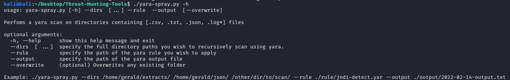

# Threat-Hunting-Tools
Tools to help facilitate workflow during threat hunting

First script to run would be logs-extractor.py
Server Admins often would give logs in archived form (.zip, .tar, .tar.gz etc.) and this script helps to automate the process of extraction into a specified folder.

------------------------------------------------------------------------------------------------------------------------------------------------------------------
Second script to run would be evtx-converter.py
Windows Servers would contain many Windows Event Logs that needs to be converted to json for readability and for yara scanning later on.

------------------------------------------------------------------------------------------------------------------------------------------------------------------
Last script to run would be yara-spray.py
This is just a lazy way to recursively perform a yara scan with a specified yara rule on all directories you supply recursively. And writes yara results to an
output file.

